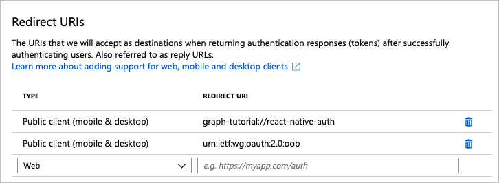

<!-- markdownlint-disable MD002 MD041 -->

この手順では、Azure Active Directory 管理センターを使用して、新しい Azure AD ネイティブアプリケーションを作成します。In this exercise you will create a new Azure AD native application using the Azure Active Directory admin center.

1. ブラウザーを開き、[Azure Active Directory 管理センター](https://aad.portal.azure.com)へ移動して、**個人用アカウント** (別名: Microsoft アカウント)、または**職場/学校アカウント**を使用してログインします。Open a browser and navigate to the [Azure Active Directory admin center](https://aad.portal.azure.com) and login using a **personal account** (aka: Microsoft Account) or **Work or School Account**.

1. 左側のナビゲーションで [ **Azure Active Directory** ] を選択し、[**管理**] の下にある [**アプリの登録**] を選択します。Select **Azure Active Directory** in the left-hand navigation, then select **App registrations** under **Manage**.

    

1. **[新規登録]** を選択します。Select **New registration**. **[アプリケーションを登録]** ページで、次のように値を設定します。On the **Register an application** page, set the values as follows.

    - `React Native Graph Tutorial` に **[名前]** を設定します。Set **Name** to `React Native Graph Tutorial`.
    - **[サポートされているアカウントの種類]** を **[任意の組織のディレクトリ内のアカウントと個人用の Microsoft アカウント]** に設定します。Set **Supported account types** to **Accounts in any organizational directory and personal Microsoft accounts**.
    - [**リダイレクト URI**] で、ドロップダウンを [**パブリッククライアント (モバイル & デスクトップ)**] に変更し`graph-tutorial://react-native-auth`、値をに設定します。Under **Redirect URI**, change the dropdown to **Public client (mobile & desktop)**, and set the value to `graph-tutorial://react-native-auth`.

    ![[アプリケーションの登録] ページのスクリーンショット](./images/aad-register-an-app.png)

1. [**登録**] を選択します。Select **Register**. [**ネイティブグラフの応答] チュートリアル**ページで、**アプリケーション (クライアント) ID**の値をコピーして保存します。そのためには、次の手順を実行する必要があります。On the **React Native Graph Tutorial** page, copy the value of the **Application (client) ID** and save it, you will need it in the next step.

    

1. [**管理**] で、[**認証**] を選択します。Under **Manage**, select **Authentication**. [**リダイレクト uri** ] ページで、uri `urn:ietf:wg:oauth:2.0:oob`を使用して、**パブリッククライアント (モバイル & デスクトップ)** 型の別のリダイレクト URI を追加します。On the **Redirect URIs** page, add another redirect URI of type **Public client (mobile & desktop)**, with the URI `urn:ietf:wg:oauth:2.0:oob`. [**保存**] を選択します。Select **Save**.

    
