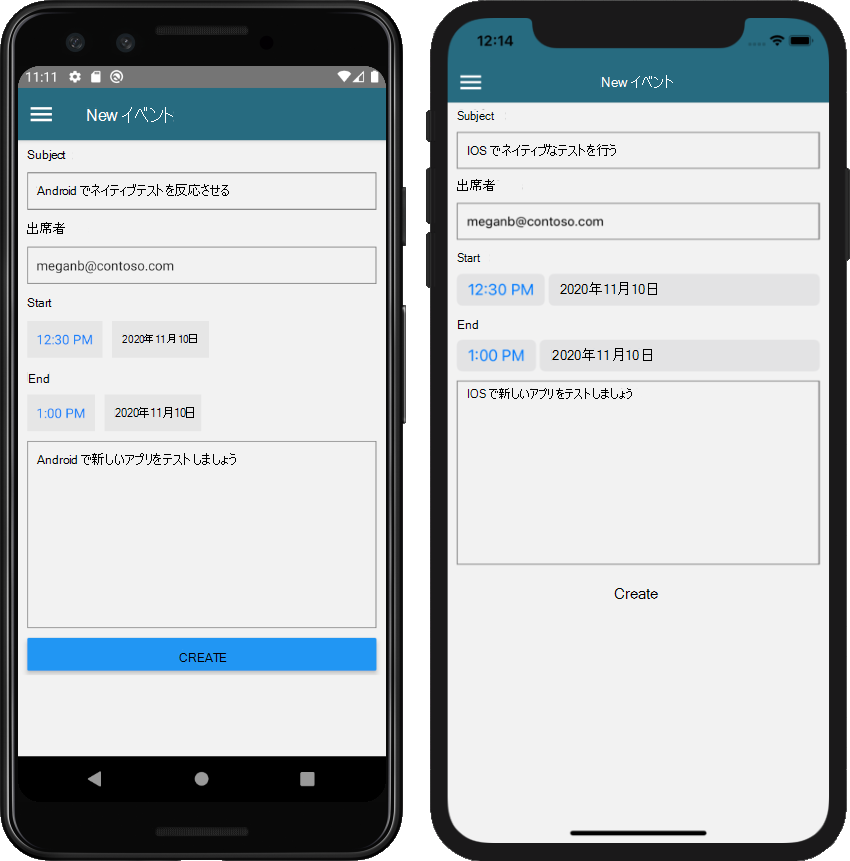

<!-- markdownlint-disable MD002 MD041 -->

このセクションでは、ユーザーの予定表にイベントを作成する機能を追加します。

## <a name="create-the-new-event-screen"></a>新しいイベント画面を作成する

1. を開き、次の関数をクラスに追加し **ます。** `GraphManager`

    :::code language="typescript" source="../demo/GraphTutorial/graph/GraphManager.ts" id="CreateEventSnippet":::

    この関数は、Graph SDK を使用して新しいイベントを作成します。

1. **NewEventScreen** という名前の **スクリーン** に新しいファイルを作成し、次のコードを追加します。

    :::code language="typescript" source="../demo/GraphTutorial/screens/NewEventScreen.tsx" id="NewEventScreenSnippet":::

    関数の動作を検討 `createEvent` します。 `MicrosoftGraph.Event`フォームからの値を使用してオブジェクトを作成し、そのオブジェクトを関数に渡し `GraphManager.createEvent` ます。

1. **/Menus/DrawerMenu.tsx** を開き、次の `import` ステートメントをファイルの先頭に追加します。

    ```typescript
    import NewEventScreen from '../screens/NewEventScreen';
    ```

1. 次のコードを、要素内の `<Drawer.Navigator>` 行のすぐ上に追加し `</Drawer.Navigator>` ます。

    ```typescript
    { userLoaded &&
      <Drawer.Screen name='NewEvent'
        component={NewEventScreen}
        options={{drawerLabel: 'New event'}} />
    }
    ```

1. 変更を保存し、アプリを再起動または更新します。 メニューの [ **新しいイベント** ] オプションを選択して、新しいイベントフォームを表示します。

1. フォームに入力し、[ **作成** ] を選択します。

    
